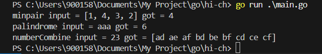
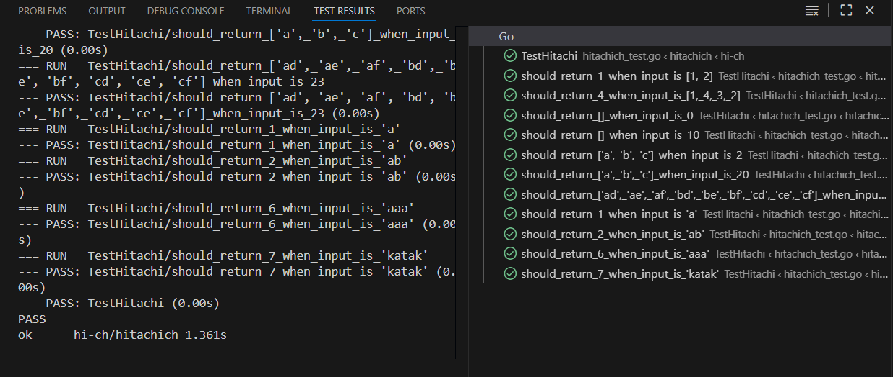

# HOW TO RUN CODE

## Clone Repository

> git clone https://github.com/robysetyaw/hitachich

## Get In

> cd hitachich

## Go Mod Tidy

> go mod tidy

## Run the project

> go run main.go

## Result

## Unit Test Passed
